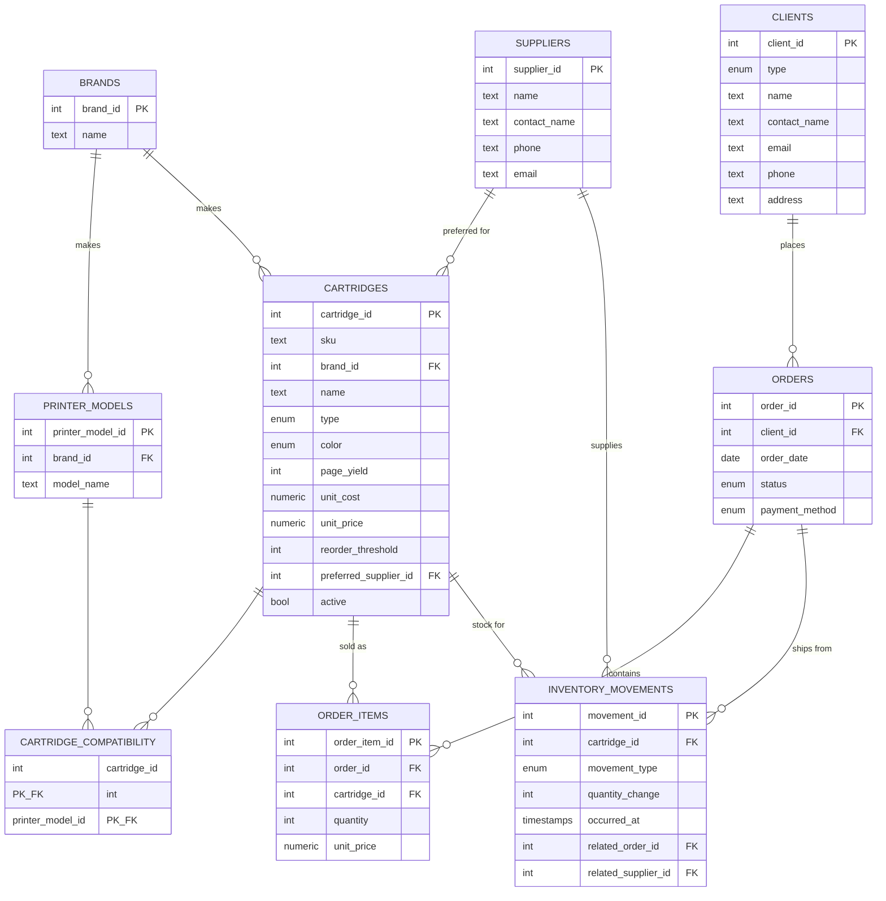

# CJ Toner Express — Inventory & Operations Database

CJ Toner Express is a toner and ink cartridge shop in San Juan, PR that serves
both walk-in customers and small-business accounts — law firms, doctors' offices,
schools, movie theaters and print shops. Before this system, daily operations ran on pen and
paper: clerks counted boxes by hand, wrote receipts by hand, and flipped through
a compatibility binder every time a customer brought in a printer to match.

This PostgreSQL database replaced that workflow. It tracks the shop's full
product catalog with printer compatibility, client accounts, orders, and an
inventory audit trail. Daily admin time dropped from 5–6 hours to 1–2 hours,
and the system has been in production use since 2021.

## What it manages

- **Products** — every cartridge SKU the shop carries, with brand, type (toner vs. ink),
  color, page yield, cost, price, and reorder threshold
- **Printer compatibility** — which cartridges fit which printer models, so a
  clerk can answer a customer at the counter in seconds instead of digging through a binder
- **Clients** — walk-in individuals and business accounts, with contact info and order history
- **Orders** — full order records with line-item prices captured at sale time so
  historical totals never shift when catalog prices change
- **Inventory** — an append-only audit trail of every receipt, sale, return, and
  adjustment, so current stock is always explainable and month-end recounts are trivial

## Schema at a glance



### Design notes

- **Inventory is an append-only audit trail, not a single `current_stock`
  column.** Every receipt, sale, return, and adjustment is its own row in
  `inventory_movements`. Current stock is `SUM(quantity_change)` per
  cartridge, exposed through the `v_stock_on_hand` view. This makes
  month-end recounts and discrepancy investigations straightforward —
  you can always see *why* the number is what it is.
- **Order-line prices are captured at sale time** (`order_items.unit_price`)
  so historical totals don't shift if the catalog price changes later.
- **Many-to-many compatibility** between cartridges and printer models —
  a cartridge usually fits several printers, and a printer usually takes
  several cartridges (standard- and high-yield, color set, etc.).
- **`client_type`, `cartridge_type`, `cartridge_color`, `order_status`,
  `payment_method`, `movement_type`** are PostgreSQL `ENUM`s so bad
  values are rejected at the database layer.
- **Two convenience views** (`v_stock_on_hand`, `v_order_totals`) keep
  the day-to-day queries short and readable.

## The queries that run daily operations

Each query in [`queries.sql`](queries.sql) maps to a task the shop runs regularly:

| #  | Query                                | What it replaced                                  |
|----|--------------------------------------|---------------------------------------------------|
| 1  | Low-stock report                     | Walking to the back room and counting boxes       |
| 2  | "What cartridge fits this printer?"  | Thumbing through a compatibility binder           |
| 3  | Top clients by revenue (YTD)         | Flipping through a paper ledger at month end      |
| 4  | Monthly sales summary                | Tallying receipts at month end                    |
| 5  | Recent orders for a recurring client | Digging through a binder when a regular calls     |
| 6  | Reorder list grouped by supplier     | Manually figuring out who to call for what        |
| 7  | Outstanding quotes                   | A sticky note on the monitor                      |
| 8  | Inventory audit trail per cartridge  | Explaining a stock discrepancy after the fact     |

## Getting it running

You need PostgreSQL 12 or newer. On macOS:

```bash
brew install postgresql@16
brew services start postgresql@16
```

Create the database and load the schema and seed data:

```bash
createdb cj_toner_express
psql -d cj_toner_express -f schema.sql
psql -d cj_toner_express -f seed.sql
```

Run the example queries:

```bash
psql -d cj_toner_express -f queries.sql
```

To start from a clean slate:

```bash
dropdb cj_toner_express
```

## Repo layout

```
cj-toner-express-db/
├── README.md      this file
├── schema.sql     table definitions, enums, indexes, views
├── seed.sql       sample data
└── queries.sql    the daily-operations queries above
```
